el # GRADEX - Prototipo 2


### 1. **Team** 
- name: 2F  
- Integrantes: 
    - David Stiven Martinez Triana 
    - Carlos Sebastian Gomez Fernandez 
    - Nestor Steven Piraquive Garzon 
    - Luis Alfonso Pedraos Suarez 
    - Cesar Fabian Rincon Robayo 
### 2. **Software System** 
- name: Gradex 
- Logo:
  


- Description: Sistema de Gestión de calificaciones para colegios.


## Repositorio del proyecto

Para utilizar el proyecto simplemente clona el repositorio principal, el cual ya incluye todos los submódulos necesarios:

```bash
git clone --recursive https://github.com/Swarch2F/prototipo3.git
cd prototipo3
```

## Información sobre submódulos (Solo informativo)

Los submódulos fueron agregados inicialmente con estos comandos, pero no necesitas ejecutarlos nuevamente:

```bash
git submodule add https://github.com/Swarch2F/component-1.git components/component-1
git submodule add https://github.com/Swarch2F/component-2-1.git components/component-2-1
git submodule add https://github.com/Swarch2F/component-2-2.git components/component-2-2
git submodule add https://github.com/Swarch2F/component-3.git components/component-3
git submodule add https://github.com/Swarch2F/component-4.git components/component-4
git submodule add https://github.com/Swarch2F/broker.git components/broker
git submodule add https://github.com/Swarch2F/api-gateway.git components/api-gateway
```

## Actualización de submódulos recursivamente (por primer vez una vez clonado el proyecto):

```bash
git submodule update --init --recursive
git submodule update --remote --merge --recursive
```

## Arquitectura del Sistema

GRADEX implementa una **arquitectura de microservicios con proxy inverso** que proporciona seguridad y escalabilidad:

```mermaid
graph TB
    subgraph "ACCESO EXTERNO"
        USER[👤 Usuario]
        INTERNET[🌐 Internet - Puerto 80]
    end
    
    subgraph "CAPA DE SEGURIDAD"
        NGINX[🔒 NGINX Proxy<br/>Punto de Entrada Único<br/>gx_nginx_proxy]
    end
    
    subgraph "CAPA DE APLICACIÓN"
        FE[🌐 Frontend Next.js<br/>gx_fe_gradex<br/>:3000]
        GW[⚡ API Gateway<br/>gx_api_gateway<br/>:4000]
    end
    
    subgraph "MICROSERVICIOS"
        MS1[📚 SIA Colegios<br/>Django :8083]
        MS2[👨‍🏫 Profesores<br/>Java :8080]
        MS3[📊 Calificaciones<br/>Java :8081]
        MS4[🔐 Autenticación<br/>Go :8082]
        MS5[📨 Broker<br/>Node.js :3000]
    end
    
    subgraph "CAPA DE DATOS"
        DB1[(PostgreSQL SIA)]
        DB2[(PostgreSQL Auth)]
        DB3[(MongoDB Profesores)]
        DB4[(MongoDB Calificaciones)]
        DB5[(RabbitMQ)]
    end
    
    USER --> INTERNET
    INTERNET --> NGINX
    NGINX --> FE
    NGINX --> GW
    GW --> MS1
    GW --> MS2
    GW --> MS3
    GW --> MS4
    GW --> MS5
    MS1 --> DB1
    MS2 --> DB3
    MS3 --> DB4
    MS4 --> DB2
    MS5 --> DB5
    
    classDef proxy fill:#ff6b6b,stroke:#d63031,stroke-width:3px,color:#fff
    classDef app fill:#74b9ff,stroke:#0984e3,stroke-width:2px,color:#fff
    classDef micro fill:#55a3ff,stroke:#2980b9,stroke-width:2px,color:#fff
    classDef db fill:#6c5ce7,stroke:#5f39bb,stroke-width:2px,color:#fff
    
    class NGINX proxy
    class FE,GW app
    class MS1,MS2,MS3,MS4,MS5 micro
    class DB1,DB2,DB3,DB4,DB5 db
```



### 🔒 **Proxy Inverso NGINX**

El sistema incluye un **módulo de proxy inverso** (`components/nginx/`) que actúa como:
- **Punto de entrada único**: Solo puerto 80 expuesto externamente
- **Capa de seguridad**: Rate limiting, headers seguros, bloqueo de archivos
- **Balanceador de carga**: Distribución inteligente de requests
- **Terminación SSL**: Preparado para certificados HTTPS

## Levantar el prototipo con Docker Compose

El proyecto utiliza Docker Compose para gestionar la ejecución de todos los servicios, **incluyendo un proxy inverso nginx con seguridad**.

### Ejecución rápida

Una vez clonado el proyecto, ejecuta:

```bash
docker compose up --build
```

Este comando levantará **todos los servicios** incluyendo:
- 🔒 **Proxy NGINX** (puerto 80) - Punto de entrada principal
- 🌐 **Frontend Next.js** (acceso vía proxy)
- ⚡ **API Gateway GraphQL** (acceso vía proxy)
- 📚 **Microservicios** (SIA, Profesores, Calificaciones, Auth)
- 🗄️ **Bases de datos** (PostgreSQL, MongoDB)
- 📨 **Message Broker** (RabbitMQ)

**OJO**: Para ejecutar todo correctamente se necesitan las variables de entorno del servicio
de autenticación, las cuales son sensibles, pero se puede cargar el archivo .env y ejecutar el script
que automatiza todo:

```bash
./start.sh
```

**Acceso inmediato**: Una vez levantado, accede a `http://localhost/` para usar GRADEX con seguridad completa.

## Acceso a servicios

### 🔒 **Acceso Principal (Recomendado - Con Seguridad)**
A través del proxy inverso nginx con capa de seguridad:
* **Frontend GRADEX:** `http://localhost/`
* **API GraphQL:** `http://localhost/graphql`
* **Health Check Proxy:** `http://localhost/nginx-health`

### 🔧 **Acceso Directo (Solo para Desarrollo)**
Acceso directo a microservicios individuales:
* **Gestión de Estudiantes y Cursos (gx_be_estcur):** `http://localhost:8083/`
* **Profesores y Asignaturas (gx_be_proasig):** `http://localhost:8080/graphiql`
* **Calificaciones (gx_be_calif):** `http://localhost:8081/graphiql`
* **Autenticación (gx_be_auth):** `http://localhost:8082/api/v1`
* **RabbitMQ Management:** `http://localhost:15673/`
* **Broker Messages:** `http://localhost:3000/health`

### Gestión de contenedores

Para verificar el estado de los contenedores utiliza:

```bash
docker ps
```

Para pausar un contenedor utiliza el siguiente comando:
```bash
docker compose stop <nombre del contenedor>
```

Para volver a ejecutar un contenedor pausado utiliza el siguiente comando:
```bash
docker compose start <nombre del contenedor>
```

## 🔒 Seguridad

El proyecto incluye un **proxy inverso nginx** que proporciona:
- **Rate limiting**: Protección contra ataques DDoS
- **Headers de seguridad**: X-Frame-Options, CSP, XSS Protection
- **Filtrado de requests**: Bloqueo de archivos sensibles
- **Punto de entrada único**: Solo puerto 80 expuesto externamente
- **Logging centralizado**: Auditoría de todo el tráfico

### 🛡️ **Características de Seguridad Implementadas**

| **Característica** | **Configuración** | **Beneficio** |
|-------------------|------------------|---------------|
| **Rate Limiting API** | 10 requests/segundo | Protección DDoS en GraphQL |
| **Rate Limiting General** | 30 requests/segundo | Protección DDoS general |
| **Headers de Seguridad** | X-Frame-Options, CSP, XSS | Anti-clickjacking, XSS |
| **Bloqueo de Archivos** | `.env`, `.sql`, `.config` | Protección de archivos sensibles |
| **Métodos HTTP** | Solo GET, POST, OPTIONS | Reducción superficie ataque |
| **Timeouts** | 30s conexión/lectura/envío | Anti-slowloris |

### 🧪 **Testing del Proxy**

Para verificar que el proxy está funcionando correctamente:

```powershell
# Ejecutar suite de tests automática
powershell -ExecutionPolicy Bypass -File "components/nginx/test-proxy.ps1"

# Tests manuales individuales
Invoke-WebRequest -Uri "http://localhost/"              # ✅ Frontend (200)
Invoke-WebRequest -Uri "http://localhost/graphql"       # ⚠️ API (400 - normal)
Invoke-WebRequest -Uri "http://localhost/nginx-health"  # ✅ Health (200)
Invoke-WebRequest -Uri "http://localhost/.env"          # 🚫 Bloqueado (403)
```

## Bases de datos

El proyecto utiliza PostgreSQL para el almacenamiento de datos. Las bases de datos se inicializan automáticamente con datos de prueba y se persisten en volúmenes de Docker.

### Configuración de bases de datos

* **Base de datos principal (gx_db_estcur):**
  - Puerto: 5432
  - Usuario: postgres
  - Contraseña: postgres
  - Base de datos: gradex_estcur

* **Base de datos de autenticación (gx_db_auth):**
  - Puerto: 5433
  - Usuario: postgres
  - Contraseña: postgres
  - Base de datos: gradex_auth

## Notas importantes

- Las credenciales por defecto para RabbitMQ son:
  - Usuario: guest
  - Contraseña: guest
- La base de datos PostgreSQL para estudiantes y cursos se inicializa automáticamente con datos de prueba
- Los datos de las bases de datos se persisten en volúmenes de Docker
- El servicio de autenticación utiliza JWT para la gestión de tokens
- Los servicios GraphQL (Profesores y Asignaturas, Calificaciones) incluyen una interfaz GraphiQL para pruebas

### 📊 **Monitoreo y Logs**

- **Logs del Proxy**: `docker logs gx_nginx_proxy -f` (tiempo real)
- **Logs de Error**: `docker logs gx_nginx_proxy 2>&1 | findstr "error"`
- **Health Check**: `http://localhost/nginx-health` (verificación rápida)
- **Estado de Contenedores**: `docker ps` (verificar todos los servicios)

### 🔧 **Troubleshooting**

Si experimentas problemas:

1. **Verificar servicios**: `docker ps` - todos los contenedores deben estar "Up"
2. **Reiniciar proxy**: `docker restart gx_nginx_proxy`
3. **Ver logs**: `docker logs gx_nginx_proxy --tail 20`
4. **Test conectividad**: Ejecutar `components/nginx/test-proxy.ps1`

### 📚 **Documentación Adicional**

- **Proxy NGINX**: Ver `components/nginx/README.md` para documentación detallada
- **API Gateway**: Ver `components/api-gateway/README.md`
- **Frontend**: Ver `components/component-3/README.md`
- **Autenticación**: Ver `components/component-4/README.md`

---
**© 2025 Swarch2F. GRADEX Prototipo 2** 
