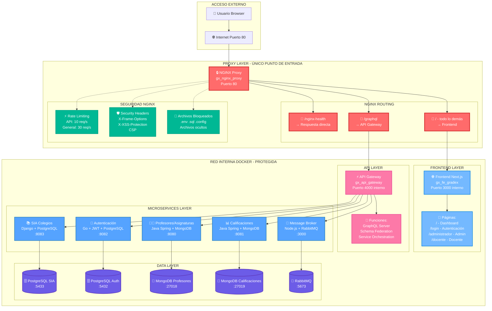
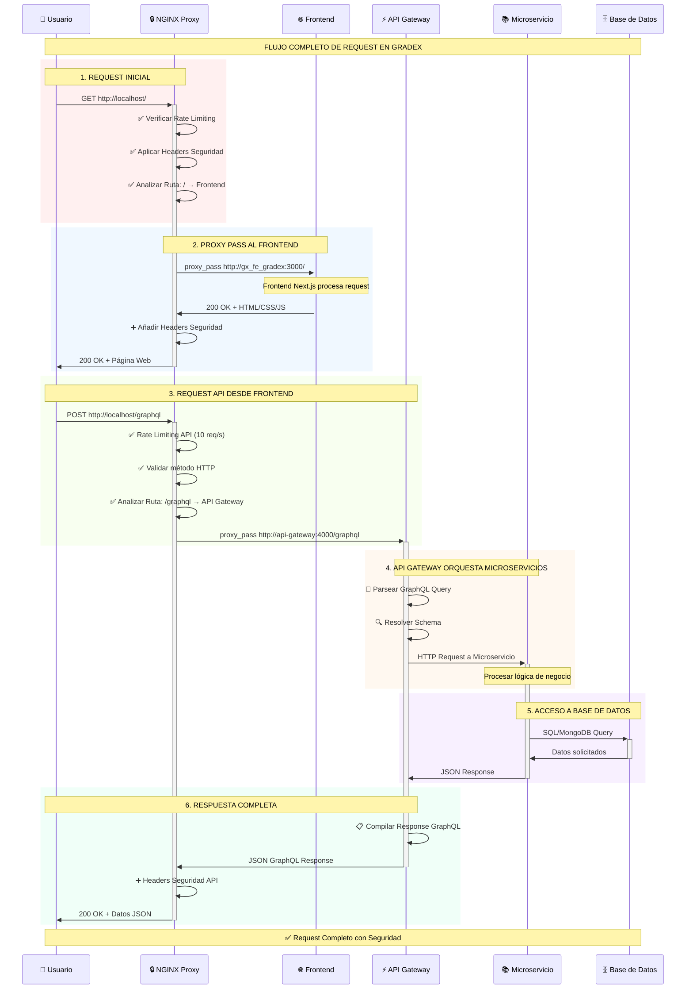

# 🔒 Proxy Inverso NGINX - Sistema GRADEX

## 📖 **ÍNDICE**
1. [¿Qué es y para qué sirve?](#-qué-es-y-para-qué-sirve)
2. [Flujo de Datos Completo](#-flujo-de-datos-completo)
3. [Configuración Detallada](#-configuración-detallada)
4. [Arquitectura de Seguridad](#-arquitectura-de-seguridad)
5. [Routing y Direccionamiento](#-routing-y-direccionamiento)
6. [Integración con Docker](#-integración-con-docker)
7. [Monitoreo y Logs](#-monitoreo-y-logs)
8. [Testing y Verificación](#-testing-y-verificación)

---

## 🎯 **¿QUÉ ES Y PARA QUÉ SIRVE?**

El **Proxy Inverso NGINX** en GRADEX actúa como la **puerta de entrada única** y **capa de seguridad** de todo el sistema. Es el único componente que expone un puerto al exterior (80), mientras que todos los demás servicios quedan protegidos en la red interna de Docker.

### **🔐 Funciones Principales**
- **Punto de entrada único**: Solo el puerto 80 está expuesto externamente
- **Proxy inverso**: Redirige las peticiones a los servicios internos apropiados
- **Capa de seguridad**: Headers, rate limiting, bloqueo de archivos sensibles
- **Balanceador de carga**: Distribución de conexiones con keepalive
- **Terminación SSL**: Preparado para HTTPS (futuro)

---

## 🔄 **FLUJO DE DATOS COMPLETO**

### **🏗️ Arquitectura Visual Completa**



### **📋 Descripción del Flujo**

1. **Usuario hace request** → `http://localhost/cualquier-ruta`
2. **NGINX recibe** → Puerto 80 (único puerto expuesto)
3. **NGINX analiza la ruta**:
   - `/nginx-health` → Respuesta directa del nginx
   - `/graphql` → Proxy a `api-gateway:4000`
   - Todo lo demás → Proxy a `gx_fe_gradex:3000`
4. **Servicios procesan** → En red interna Docker
5. **NGINX retorna respuesta** → Con headers de seguridad añadidos

### **🔄 Flujo Detallado de Request**



---

## ⚙️ **CONFIGURACIÓN DETALLADA**

### **🔗 Upstream Servers (Destinos Internos)**

```nginx
# Destino 1: API Gateway (GraphQL)
upstream api_gateway {
    server api-gateway:4000;    # Nombre del contenedor + puerto interno
    keepalive 32;               # Pool de conexiones reutilizables
}

# Destino 2: Frontend Next.js
upstream frontend {
    server gx_fe_gradex:3000;   # Nombre del contenedor + puerto interno
    keepalive 32;               # Pool de conexiones reutilizables
}
```

### **🎯 Routing Rules (Reglas de Direccionamiento)**

| **Ruta de Entrada** | **Destino Interno** | **Propósito** |
|---------------------|---------------------|---------------|
| `/nginx-health` | Respuesta directa nginx | Health check del proxy |
| `/graphql` | `api-gateway:4000` | API GraphQL para datos |
| `/` (todo lo demás) | `gx_fe_gradex:3000` | Frontend Next.js |

### **🛡️ Configuración de Seguridad**

```nginx
# Rate Limiting (Límites de Requests)
limit_req_zone $binary_remote_addr zone=api_limit:10m rate=10r/s;     # API: 10 req/seg
limit_req_zone $binary_remote_addr zone=general_limit:10m rate=30r/s; # General: 30 req/seg

# Headers de Seguridad Globales
add_header X-Frame-Options "SAMEORIGIN" always;                    # Anti-clickjacking
add_header X-Content-Type-Options "nosniff" always;               # Anti-MIME sniffing
add_header X-XSS-Protection "1; mode=block" always;               # Anti-XSS
add_header Referrer-Policy "strict-origin-when-cross-origin" always;
add_header Content-Security-Policy "default-src 'self'; ..." always; # CSP completa
```

### **⏱️ Timeouts y Límites**

| **Configuración** | **Valor** | **Propósito** |
|-------------------|-----------|---------------|
| `client_max_body_size` | 10M | Límite de uploads |
| `client_body_timeout` | 60s | Timeout subida datos |
| `client_header_timeout` | 60s | Timeout headers |
| `proxy_connect_timeout` | 30s | Timeout conexión backend |
| `proxy_send_timeout` | 30s | Timeout envío backend |
| `proxy_read_timeout` | 30s | Timeout lectura backend |

---

## 🔒 **ARQUITECTURA DE SEGURIDAD**

### **🛡️ Capas de Protección**

```
┌─────────────────────────────────────────────────────────────┐
│                    INTERNET PÚBLICO                        │
└─────────────────────┬───────────────────────────────────────┘
                      │
                      ▼
┌─────────────────────────────────────────────────────────────┐
│               NGINX PROXY (Puerto 80)                      │
│ ✅ Rate Limiting        ✅ Headers Seguridad               │
│ ✅ Bloqueo Archivos     ✅ Validación HTTP                 │
│ ✅ Logging Completo     ✅ Timeouts                        │
└─────────────────────┬───────────────────────────────────────┘
                      │
                      ▼
┌─────────────────────────────────────────────────────────────┐
│              RED INTERNA DOCKER                            │
│ 🔒 Frontend (3000)     🔒 API Gateway (4000)              │
│ 🔒 SIA (8000)          🔒 Auth (8082)                     │
│ 🔒 Profesores (8080)   🔒 Calificaciones (8080)           │
│ 🔒 Broker (3000)       🔒 Bases de Datos                  │
└─────────────────────────────────────────────────────────────┘
```

### **🚫 Archivos y Rutas Bloqueadas**

```nginx
# Archivos ocultos (empiezan con punto)
location ~ /\. {
    deny all;                    # ❌ Bloquear .env, .git, .htaccess, etc.
}

# Archivos sensibles por extensión
location ~ \.(sql|conf|config|bak|backup|swp|tmp)$ {
    deny all;                    # ❌ Bloquear backups y configuraciones
}

# Métodos HTTP no permitidos
if ($request_method !~ ^(GET|POST|OPTIONS)$ ) {
    return 405;                  # ❌ Solo GET, POST, OPTIONS
}
```

---

## 🎯 **ROUTING Y DIRECCIONAMIENTO**

### **📍 Mapeo Completo de URLs**

| **URL Pública** | **Destino Real** | **Función** |
|-----------------|------------------|-------------|
| `http://localhost/` | `gx_fe_gradex:3000/` | Página principal |
| `http://localhost/login` | `gx_fe_gradex:3000/login` | Página de login |
| `http://localhost/administrador` | `gx_fe_gradex:3000/administrador` | Panel admin |
| `http://localhost/docente` | `gx_fe_gradex:3000/docente` | Panel docente |
| `http://localhost/graphql` | `api-gateway:4000/graphql` | API GraphQL |
| `http://localhost/nginx-health` | **Respuesta directa nginx** | Health check |

### **🔄 Proceso de Proxy Pass**

```nginx
# Ejemplo: /graphql
location /graphql {
    # 1. Aplicar rate limiting
    limit_req zone=api_limit burst=20 nodelay;
    
    # 2. Validar método HTTP
    if ($request_method !~ ^(GET|POST|OPTIONS)$) {
        return 405;
    }
    
    # 3. Añadir headers de identificación
    add_header X-API-Gateway "GRADEX-v1" always;
    
    # 4. Hacer proxy pass con headers
    proxy_pass http://api_gateway;              # → api-gateway:4000
    proxy_set_header Host $host;                # Mantener host original
    proxy_set_header X-Real-IP $remote_addr;   # IP real del cliente
    proxy_set_header X-Forwarded-For $proxy_add_x_forwarded_for;
    proxy_set_header X-Forwarded-Proto $scheme;
}
```

---

## 🐳 **INTEGRACIÓN CON DOCKER**

### **📦 Configuración en docker-compose.yml**

```yaml
# Nginx Proxy - ÚNICO puerto expuesto externamente
nginx-proxy:
  container_name: gx_nginx_proxy
  ports:
    - "80:80"                                    # ✅ ÚNICO puerto externo
  volumes:
    - ./components/nginx/nginx.conf:/etc/nginx/nginx.conf:ro
  depends_on:
    - api-gateway                                # Espera a API Gateway
    - gx_fe_gradex                              # Espera a Frontend
  networks:
    - microservices-network                      # Red interna Docker

# Frontend - Solo puerto interno
gx_fe_gradex:
  container_name: gx_fe_gradex
  expose:
    - "3000"                                     # 🔒 Solo red interna
  environment:
    - API_URL=http://localhost/graphql           # Usar proxy para API

# API Gateway - Solo puerto interno  
api-gateway:
  container_name: gx_api_gateway
  expose:
    - "4000"                                     # 🔒 Solo red interna
```

### **🌐 Resolución de Nombres en Docker**

Docker crea automáticamente un DNS interno donde:
- `api-gateway` → Resuelve a IP interna del contenedor `gx_api_gateway`
- `gx_fe_gradex` → Resuelve a IP interna del contenedor frontend
- Todos están en la red `microservices-network`

---

## 📊 **MONITOREO Y LOGS**

### **📝 Configuración de Logging**

```nginx
# Formato de logs personalizado
log_format main '$remote_addr - $remote_user [$time_local] "$request" '
                '$status $body_bytes_sent "$http_referer" '
                '"$http_user_agent" "$http_x_forwarded_for"';

access_log /var/log/nginx/access.log main;      # Todos los requests
error_log /var/log/nginx/error.log warn;        # Solo errores
```

### **🔍 Comandos de Monitoreo**

```powershell
# Ver logs en tiempo real
docker logs gx_nginx_proxy -f

# Ver últimas 50 líneas
docker logs gx_nginx_proxy --tail 50

# Ver logs de errores específicos
docker logs gx_nginx_proxy 2>&1 | findstr "error"

# Ver estadísticas de requests
docker exec gx_nginx_proxy cat /var/log/nginx/access.log | findstr "200"
```

### **📈 Información en los Logs**

| **Campo** | **Descripción** | **Ejemplo** |
|-----------|-----------------|-------------|
| `$remote_addr` | IP del cliente | `172.18.0.1` |
| `$time_local` | Timestamp | `[28/Jun/2025:01:43:21 +0000]` |
| `$request` | Request completo | `"GET /graphql HTTP/1.1"` |
| `$status` | Código de respuesta | `200`, `404`, `403` |
| `$http_user_agent` | Navegador | `Mozilla/5.0...` |

---

## 🧪 **TESTING Y VERIFICACIÓN**

### **✅ Health Checks Disponibles**

```powershell
# 1. Health check del proxy
Invoke-WebRequest -Uri "http://localhost/nginx-health"

# 2. Test del frontend
Invoke-WebRequest -Uri "http://localhost/"

# 3. Test del API Gateway (debería dar 400 - normal)
Invoke-WebRequest -Uri "http://localhost/graphql"

# 4. Test de archivos bloqueados (debería dar 403)
Invoke-WebRequest -Uri "http://localhost/.env"
```

### **🔄 Script de Testing Automatizado**

```powershell
# Ejecutar suite completa de tests
powershell -ExecutionPolicy Bypass -File "components/nginx/test-proxy.ps1"
```

### **📊 Resultados Esperados**

| **Test** | **URL** | **Status Esperado** | **Significado** |
|----------|---------|-------------------|-----------------|
| Health Check | `/nginx-health` | `200 OK` | Proxy funcionando |
| Frontend | `/` | `200 OK` | App accesible |
| GraphQL | `/graphql` | `400 Bad Request` | Normal (necesita POST) |
| Archivo .env | `/.env` | `403 Forbidden` | Seguridad activa |
| Archivo .sql | `/backup.sql` | `403 Forbidden` | Seguridad activa |

---

## 🎯 **BENEFICIOS DE ESTA IMPLEMENTACIÓN**

### **🔒 Seguridad**
- **Punto de entrada único**: Solo puerto 80 expuesto
- **Aislamiento de servicios**: Microservicios en red interna
- **Protección DDoS**: Rate limiting por IP
- **Headers de seguridad**: Protección contra XSS, clickjacking
- **Bloqueo de archivos**: `.env`, `.sql`, archivos ocultos inaccesibles

### **⚡ Performance**
- **Connection pooling**: Keepalive hacia backends
- **Balanceador de carga**: Distribución de conexiones
- **Terminación SSL**: Preparado para HTTPS
- **Compression**: Preparado para gzip

### **🛠️ Operacional**
- **Logs centralizados**: Todo el tráfico auditado
- **Health checks**: Monitoreo de disponibilidad
- **Configuración declarativa**: Infrastructure as Code
- **Escalabilidad**: Fácil añadir más backends

---

## 🚀 **PRÓXIMOS PASOS RECOMENDADOS**

1. **🔐 SSL/HTTPS**: Implementar certificados SSL
2. **📊 Métricas**: Integrar con Prometheus/Grafana
3. **🛡️ WAF**: Web Application Firewall
4. **🌐 CDN**: Content Delivery Network para estáticos
5. **📈 Caching**: Cache Redis para responses

---

**✅ El proxy nginx está funcionando perfectamente como capa de seguridad y punto de entrada único para todo el sistema GRADEX.** 